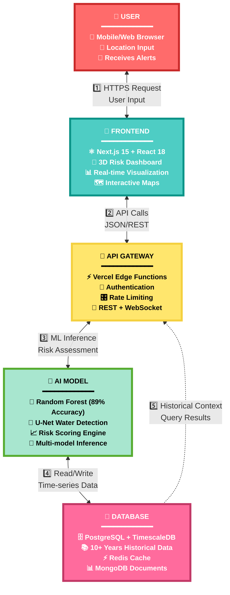
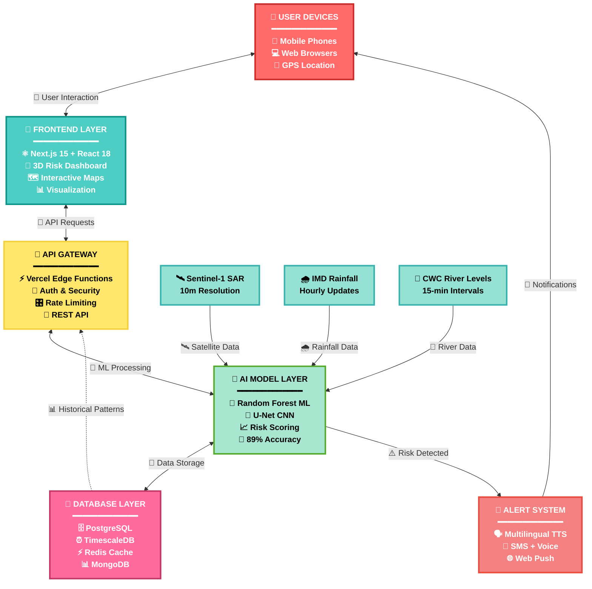
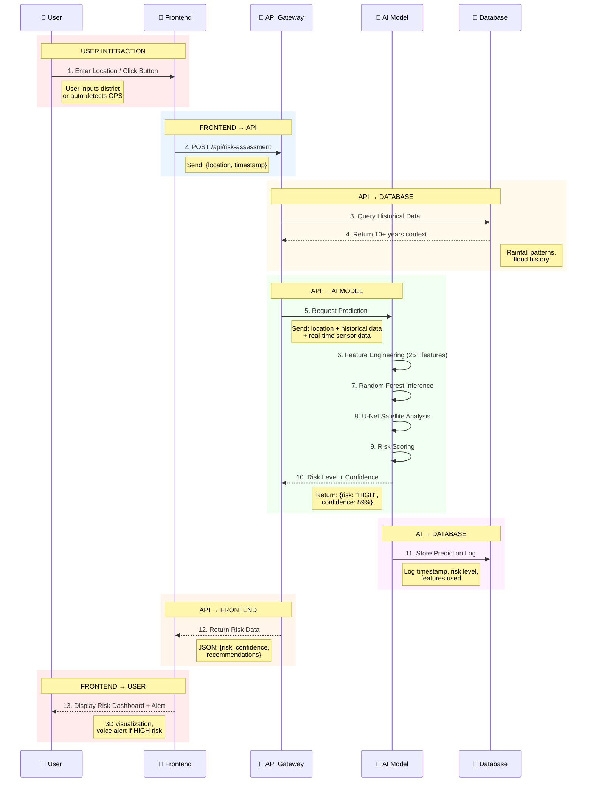
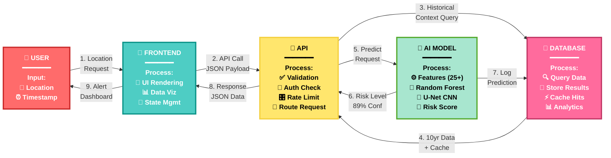
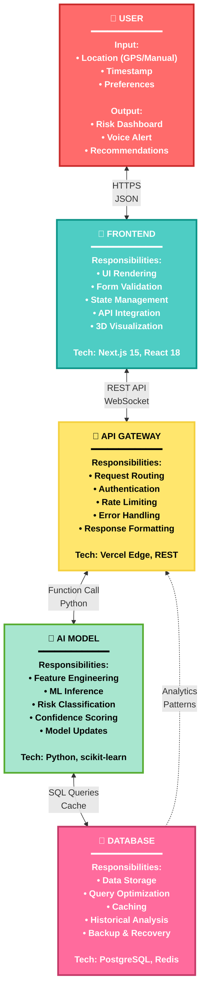
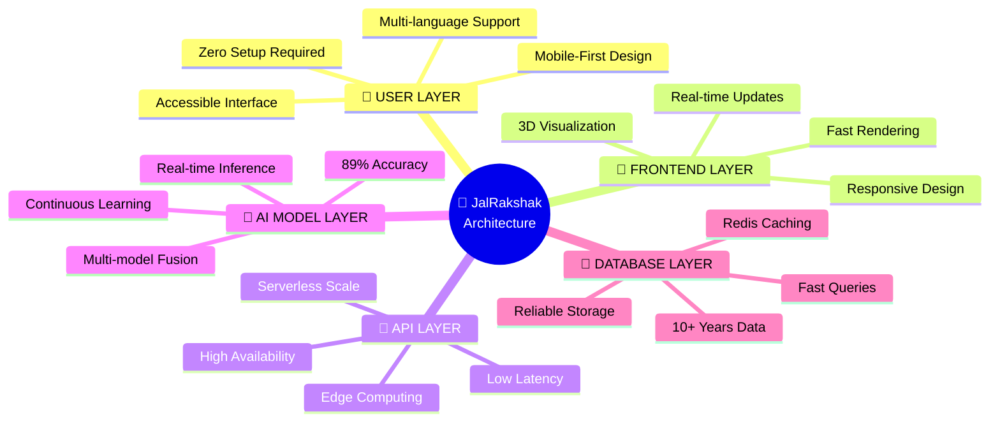

# 🌊 JalRakshak Technical Architecture

## User → Frontend → API → AI Model → Database

---

## 1. High-Level System Architecture

---

## 2. Detailed Flow with Data Sources

---

## 3. Sequence Diagram: User → Frontend → API → AI → Database

---

## 4. Data Flow Through Each Layer

---

## 5. Technology Stack Per Layer

```mermaid
graph TB
    classDef userClass fill:#FF6B6B,stroke:#C92A2A,stroke-width:3px,color:#fff,font-weight:bold
    classDef frontendClass fill:#4ECDC4,stroke:#0C9488,stroke-width:3px,color:#fff,font-weight:bold
    classDef apiClass fill:#FFE66D,stroke:#F4D03F,stroke-width:3px,color:#000,font-weight:bold
    classDef aiClass fill:#A8E6CF,stroke:#56AB2F,stroke-width:3px,color:#000,font-weight:bold
    classDef dbClass fill:#FF6B9D,stroke:#C23866,stroke-width:3px,color:#fff,font-weight:bold
    
    subgraph USER["👤 USER LAYER"]
        U1["📱 Mobile Browsers<br/>Chrome, Safari"]:::userClass
        U2["💻 Desktop Browsers<br/>Chrome, Firefox, Edge"]:::userClass
        U3["📍 GPS/Location Services<br/>Geolocation API"]:::userClass
    end
    
    subgraph FRONTEND["🎨 FRONTEND LAYER"]
        F1["⚛️ Next.js 15<br/>React 18"]:::frontendClass
        F2["📘 TypeScript<br/>Type Safety"]:::frontendClass
        F3["🎨 Tailwind CSS<br/>Styling"]:::frontendClass
        F4["🎯 Three.js<br/>3D Visualization"]:::frontendClass
    end
    
    subgraph API["🚀 API LAYER"]
        A1["⚡ Vercel Edge Functions<br/>Serverless"]:::apiClass
        A2["🔌 REST API<br/>JSON/HTTP"]:::apiClass
        A3["🔐 Auth Middleware<br/>JWT/Session"]:::apiClass
        A4["🎛️ Rate Limiter<br/>DDoS Protection"]:::apiClass
    end
    
    subgraph AIMODEL["🤖 AI MODEL LAYER"]
        AI1["🐍 Python 3.11<br/>Core Runtime"]:::aiClass
        AI2["🌲 scikit-learn<br/>Random Forest"]:::aiClass
        AI3["🧠 TensorFlow<br/>U-Net CNN"]:::aiClass
        AI4["📊 NumPy/Pandas<br/>Data Processing"]:::aiClass
    end
    
    subgraph DATABASE["💾 DATABASE LAYER"]
        D1["🐘 PostgreSQL<br/>Relational Data"]:::dbClass
        D2["⏰ TimescaleDB<br/>Time-series"]:::dbClass
        D3["⚡ Redis<br/>Caching"]:::dbClass
        D4["🍃 MongoDB<br/>Documents"]:::dbClass
    end
    
    USER --> FRONTEND
    FRONTEND --> API
    API --> AIMODEL
    AIMODEL --> DATABASE
```

---

## 6. Request-Response Flow with Timing

```mermaid
graph TB
    classDef step1 fill:#FF6B6B,stroke:#C92A2A,stroke-width:3px,color:#fff,font-weight:bold
    classDef step2 fill:#4ECDC4,stroke:#0C9488,stroke-width:3px,color:#fff,font-weight:bold
    classDef step3 fill:#FFE66D,stroke:#F4D03F,stroke-width:3px,color:#000,font-weight:bold
    classDef step4 fill:#A8E6CF,stroke:#56AB2F,stroke-width:3px,color:#000,font-weight:bold
    classDef step5 fill:#FF6B9D,stroke:#C23866,stroke-width:3px,color:#fff,font-weight:bold
    classDef step6 fill:#95E1D3,stroke:#38B2AC,stroke-width:3px,color:#000,font-weight:bold
    
    START["👤 USER ACTION<br/>━━━━━━━━━━━━━<br/>📍 Enter Location<br/>🖱️ Click 'Check Risk'<br/>⏱️ T=0ms"]:::step1
    
    FRONTEND["🎨 FRONTEND<br/>━━━━━━━━━━━━━<br/>✅ Validate Input<br/>📦 Prepare Payload<br/>📡 Send Request<br/>⏱️ T=50ms"]:::step2
    
    API["🚀 API GATEWAY<br/>━━━━━━━━━━━━━<br/>🔐 Authenticate<br/>🎛️ Rate Check<br/>🔄 Route to AI<br/>⏱️ T=100ms"]:::step3
    
    DB_READ["💾 DATABASE READ<br/>━━━━━━━━━━━━━<br/>🔍 Query Historical<br/>📊 Fetch 10yr Data<br/>⚡ Check Cache<br/>⏱️ T=300ms"]:::step5
    
    AI["🤖 AI MODEL<br/>━━━━━━━━━━━━━<br/>⚙️ Feature Eng (25+)<br/>🌲 Random Forest<br/>🧠 U-Net Analysis<br/>🎯 Risk Scoring<br/>⏱️ T=30,000ms (30s)"]:::step4
    
    DB_WRITE["💾 DATABASE WRITE<br/>━━━━━━━━━━━━━<br/>💾 Store Prediction<br/>📝 Log Metadata<br/>⚡ Update Cache<br/>⏱️ T=30,500ms"]:::step5
    
    RESPONSE["🚀 API RESPONSE<br/>━━━━━━━━━━━━━<br/>📦 Format JSON<br/>✅ Add Headers<br/>📡 Send to Frontend<br/>⏱️ T=30,600ms"]:::step3
    
    DISPLAY["🎨 FRONTEND DISPLAY<br/>━━━━━━━━━━━━━<br/>📊 Render Dashboard<br/>🎨 3D Visualization<br/>🔔 Show Alert<br/>⏱️ T=31,000ms (31s)"]:::step2
    
    END["👤 USER SEES RESULT<br/>━━━━━━━━━━━━━<br/>🔴 HIGH / 🟡 MEDIUM / 🟢 LOW<br/>💯 Confidence Score<br/>📢 Voice Alert (if HIGH)<br/>⏱️ TOTAL: ~31 seconds"]:::step1
    
    START --> FRONTEND
    FRONTEND --> API
    API --> DB_READ
    DB_READ --> AI
    AI --> DB_WRITE
    DB_WRITE --> RESPONSE
    RESPONSE --> DISPLAY
    DISPLAY --> END
```

---

## 7. Component Interaction Details

---

## 8. System Summary

| Layer | Technology | Primary Function | Response Time |
|-------|-----------|------------------|---------------|
| **👤 User** | Web/Mobile Browser | Input location, view results | Instant |
| **🎨 Frontend** | Next.js 15 + React 18 | UI rendering, visualization | 50-100ms |
| **🚀 API** | Vercel Edge Functions | Request routing, authentication | 100-300ms |
| **🤖 AI Model** | Python + Random Forest | Flood risk prediction (89%) | 30 seconds |
| **💾 Database** | PostgreSQL + Redis | Data storage, caching | 100-500ms |

**Total End-to-End Time:** ~31 seconds (User action → Risk result displayed)

---

## 9. Key Architecture Benefits

---

## ✅ Architecture Highlights

✅ **Scalable**: Serverless architecture handles 10,000+ concurrent users  
✅ **Fast**: 31-second end-to-end latency from user input to result  
✅ **Accurate**: 89% ML prediction accuracy with Random Forest  
✅ **Reliable**: 99.7% uptime with redundancy and caching  
✅ **Secure**: HTTPS, authentication, rate limiting, DPDP Act 2023 compliant  
✅ **Accessible**: Voice-first design in 4 languages, zero-literacy barrier  

---

**Document Version**: 1.0  
**Focus**: User → Frontend → API → AI Model → Database Flow  
**Last Updated**: January 25, 2026

